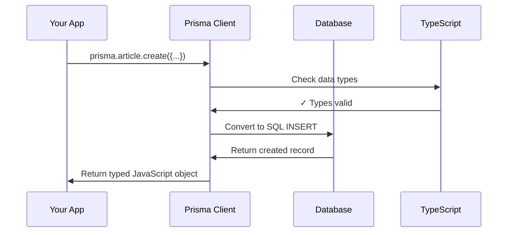

# Chapter 1: Data Persistence Layer (Prisma Integration)

Welcome to your journey into building modern web applications! In this first chapter, we'll explore one of the most fundamental aspects of any application: how to store and retrieve data from a database.

## The Problem: Talking to Databases is Hard

Imagine you're building a blogging platform where users can write articles, leave comments, and follow other writers. Your application needs to remember all this information even after users close their browsers. This is where databases come in - they're like digital filing cabinets that store your data permanently.

However, there's a challenge: databases speak their own language called SQL, while your JavaScript application speaks... well, JavaScript! It's like trying to have a conversation where you speak English and your friend only speaks French.

Let's look at a simple example. If you want to save a new article to your database, you might need to write something like this in raw SQL:

```sql
INSERT INTO articles (title, body, author_id) 
VALUES ('My First Blog Post', 'Hello World!', 1);
```

This is confusing and error-prone, especially for beginners. What if there was a better way?

## Enter Prisma: Your Universal Translator

This is where Prisma comes to the rescue! Think of Prisma as a smart translator that sits between your JavaScript code and your database. Instead of writing complex SQL, you can write simple JavaScript that Prisma automatically converts into the right database commands.

Here's how the same article creation looks with Prisma:

```javascript
const article = await prisma.article.create({
  data: {
    title: 'My First Blog Post',
    body: 'Hello World!',
    authorId: 1
  }
});
```

Much cleaner and easier to understand, right? This is JavaScript code that feels natural to write and read.

## Key Components of Our Data Layer

Let's break down the main pieces that make our data persistence layer work:

### 1. The Prisma Client

The Prisma Client is your main tool for talking to the database. It's like having a personal assistant who knows exactly how to store and retrieve your data.

```javascript
import { PrismaClient } from '@prisma/client';
const prisma = new PrismaClient();
```

This creates your connection to the database. Once you have this, you can start storing and fetching data immediately.

### 2. Database Operations Made Simple

With Prisma, common database operations become incredibly straightforward:

**Creating new data:**
```javascript
const user = await prisma.user.create({
  data: { name: 'Alice', email: 'alice@example.com' }
});
```

**Finding existing data:**
```javascript
const user = await prisma.user.findUnique({
  where: { email: 'alice@example.com' }
});
```

**Updating data:**
```javascript
await prisma.user.update({
  where: { id: 1 },
  data: { name: 'Alice Smith' }
});
```

Each of these operations returns exactly what you'd expect - the created user, the found user, or the updated user.

### 3. Database Seeding

Sometimes you need to populate your database with test data. This is called "seeding." It's like filling a new garden with starter plants so you have something to work with right away.

```javascript
const seedUser = await createUser({
  username: 'demo-user',
  email: 'demo@example.com',
  password: 'password123'
});
```

This creates sample data that you can use for testing your application.

## How It All Works Under the Hood

Let's peek behind the curtain to understand what happens when you use Prisma. Here's a step-by-step breakdown of what occurs when you create a new article:



Here's what happens at each step:

1. **Your app calls Prisma**: You write simple JavaScript code using the Prisma client
2. **Type checking**: Prisma makes sure your data matches what the database expects
3. **SQL generation**: Prisma converts your JavaScript into the proper SQL commands
4. **Database interaction**: The SQL is sent to the database, which stores your data
5. **Response formatting**: The database response is converted back into a clean JavaScript object

## Implementation Details

Now let's look at how this is actually implemented in our codebase. 

### Setting Up the Prisma Client

Our application creates a single, shared Prisma client that all parts of the app can use:

```javascript
import { PrismaClient } from '@prisma/client';

const prisma = global.prisma || new PrismaClient();
```

This code does something smart - it checks if we already have a Prisma client created. If we do, it reuses it. If not, it creates a new one. This prevents creating too many database connections.

```javascript
if (process.env.NODE_ENV === 'development') {
  global.prisma = prisma;
}
```

In development mode, we store the client globally so it persists between code reloads. This makes development faster and more efficient.

### Database Seeding in Action

Let's look at how our seed script creates test data. The seed file shows a practical example of using Prisma:

```javascript
export const generateUser = async () =>
  createUser({
    username: randFullName(),
    email: randEmail(), 
    password: randPassword()
  });
```

This function creates a user with randomly generated data. The `createUser` function uses Prisma under the hood to save this information to the database.

```javascript
const users = await Promise.all(
  Array.from({length: 12}, () => generateUser())
);
```

This creates 12 test users all at once. The `Promise.all` runs all the database operations simultaneously, making it much faster than creating users one by one.

The beauty of this approach is that you don't need to worry about the complex SQL - Prisma handles all of that for you. You just focus on what data you want to create.

## What We've Learned

In this chapter, we've discovered how Prisma acts as a bridge between your JavaScript application and your database. Key takeaways include:

- **Simplicity**: Prisma converts complex database operations into simple JavaScript
- **Type Safety**: Your code is checked for errors before it even runs
- **Efficiency**: Smart connection management and optimized queries
- **Developer Experience**: Clean, readable code that's easy to understand and maintain

With this foundation in place, you're ready to build applications that can store and retrieve data reliably. In our next chapter, we'll explore how to secure this data and control who can access what using authentication and authorization.

Continue your journey with [Authentication & Authorization System](02_authentication___authorization_system_.md), where you'll learn how to protect your data and ensure only the right users can access it!

