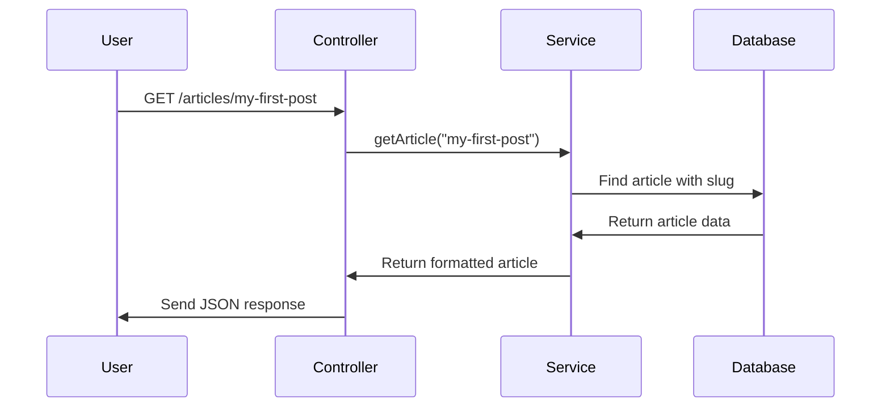

# Chapter 1: MVC Route Architecture

Welcome to the world of web application development! Imagine you're running a busy restaurant. Customers come in with different requests - some want to see the menu, others want to order food, and some want to pay their bill. How do you organize all these different requests efficiently?

This is exactly the problem that web applications face. Users send different types of requests to your server - they might want to read articles, create new posts, or log into their accounts. Without proper organization, handling all these requests would be chaos!

## What is MVC Route Architecture?

MVC Route Architecture is like having a well-organized restaurant with three key roles:

- **Controllers** (like waiters) - They greet customers, take orders, and deliver the final result
- **Services** (like the kitchen) - They contain all the business logic and do the actual work
- **Models** (like the menu) - They define what data looks like and how it's structured

Let's say a user wants to read an article on our blog. Here's how our MVC architecture handles this request:

1. The **Controller** receives the request: "Show me the article about cooking"
2. The **Service** processes this request: finds the article, checks permissions, formats the data
3. The **Model** defines what an article looks like: title, content, author, publish date
4. The **Controller** sends back the formatted article to the user

## Breaking Down the Key Concepts

### Controllers: The Traffic Directors

Controllers are like restaurant waiters - they handle incoming requests and coordinate everything. Let's look at a simple example:

```javascript
// Handle getting an article
router.get('/articles/:slug', async (req, res, next) => {
  try {
    const article = await getArticle(req.params.slug);
    res.json({ article });
  } catch (error) {
    next(error);
  }
});
```

This controller says: "When someone asks for `/articles/my-cooking-tips`, get the article with slug 'my-cooking-tips' and send it back as JSON."

### Services: The Business Logic Kitchen

Services contain all the real work - like a kitchen where the actual cooking happens. Here's a simplified service:

```javascript
export const getArticle = async (slug, userId) => {
  // Find the article in the database
  const article = await prisma.article.findUnique({
    where: { slug: slug }
  });
  
  // Format and return the article
  return formatArticle(article, userId);
};
```

The service takes care of finding the article and preparing it for the user.

### Models: The Data Structure Menu

Models define what our data looks like, just like a restaurant menu defines what dishes are available. They ensure consistency across our application.

## Solving Our Use Case: Reading an Article

Let's walk through what happens when someone visits `/articles/my-first-post`:



## How the Organization Works

In our RealWorld application, each feature has its own organized section:

### Article Feature Structure
```
/routes/article/
  ├── article.controller.ts  (handles requests)
  ├── article.service.ts     (business logic)
  └── article.model.ts       (data structure)
```

### Authentication Feature Structure  
```
/routes/auth/
  ├── auth.controller.ts     (login/register requests)
  ├── auth.service.ts        (password checking, tokens)
  └── user.model.ts          (user data structure)
```

## Looking Under the Hood

When a request comes in, here's what happens step-by-step:

1. **Route Matching**: Express.js looks at the URL and finds the right controller
2. **Authentication Check**: Middleware checks if the user is allowed to make this request
3. **Controller Action**: The controller extracts data from the request
4. **Service Call**: The controller calls the appropriate service function
5. **Database Operations**: The service interacts with the database
6. **Response Formation**: The controller formats and sends back the response

Let's see this in action with our article controller:

```javascript
// Step 1 & 2: Route matching and auth check
router.get('/articles/:slug', auth.optional, 
  async (req, res, next) => {
    try {
      // Step 3: Extract the slug from URL
      const slug = req.params.slug;
      const userId = req.auth?.user?.id;
      
      // Step 4: Call the service
      const article = await getArticle(slug, userId);
      
      // Step 6: Send response
      res.json({ article });
    } catch (error) {
      next(error);
    }
  }
);
```

Inside the service (Step 5):

```javascript
export const getArticle = async (slug, userId) => {
  // Database operation
  const article = await prisma.article.findUnique({
    where: { slug },
    include: { author: true, tags: true }
  });
  
  // Business logic: format for response
  return {
    title: article.title,
    body: article.body,
    author: article.author.username,
    createdAt: article.createdAt
  };
};
```

## The Master Routes File

All these individual feature routes come together in one central place:

```javascript
// routes.ts - The main traffic controller
const api = Router()
  .use(articlesController)    // Handle /articles/*
  .use(authController)        // Handle /users/*
  .use(profileController)     // Handle /profiles/*
  .use(tagsController);       // Handle /tags/*

export default Router().use('/api', api);
```

This creates a clean API structure:
- `/api/articles` - for article operations
- `/api/users` - for authentication
- `/api/profiles` - for user profiles
- `/api/tags` - for article tags

## Conclusion

MVC Route Architecture is like having a well-organized restaurant where everyone knows their role. Controllers greet and coordinate, services do the heavy lifting, and models define the structure. This organization makes your code easier to understand, test, and maintain.

Each feature in our application (articles, authentication, profiles, tags) follows this same pattern, creating a consistent and scalable structure. When you need to add new features, you simply create new controller-service-model groups following the same pattern.

In the next chapter, we'll dive deeper into how these services connect to and interact with our database in [Database Integration Layer](02_database_integration_layer_.md).

