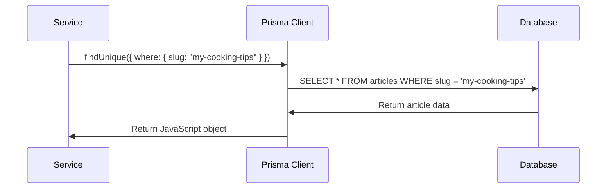

# Chapter 2: Database Integration Layer

In [Chapter 1: MVC Route Architecture](01_mvc_route_architecture_.md), we learned how our application organizes incoming requests like a well-run restaurant. Now imagine that restaurant needs to remember things - customer preferences, order history, inventory levels. Where does all this information go? That's where our database comes in!

But here's the challenge: databases speak a completely different language called SQL, while our application speaks JavaScript. It's like having a brilliant chef (our database) who only speaks French, while our waiters (our application) only speak English. We need a translator!

## What is the Database Integration Layer?

The Database Integration Layer is like having a brilliant translator who speaks both languages fluently. In our application, this translator is called **Prisma**. It automatically converts our JavaScript code into database queries, so we never have to write complex SQL ourselves.

Think of it this way: instead of learning French to talk to our chef, we simply tell our translator "I need the chicken recipe," and they handle all the complicated French conversation for us!

Let's say we want to find an article called "my-first-blog-post". Without Prisma, we'd need to write something like:

```sql
SELECT * FROM articles WHERE slug = 'my-first-blog-post'
```

With Prisma, we simply write:

```javascript
const article = await prisma.article.findUnique({
  where: { slug: 'my-first-blog-post' }
});
```

Much friendlier, right?

## Breaking Down the Key Concepts

### The Prisma Client: Your Database Assistant

The Prisma Client is like having a personal assistant who knows exactly how to talk to your database. Let's see how we set this up:

```javascript
import { PrismaClient } from '@prisma/client';

const prisma = new PrismaClient();
```

This creates our translator assistant. Now we can ask it to do things using simple JavaScript, and it will handle all the database complexity for us.

### Data Models: The Blueprint

Before our translator can work effectively, it needs to know what our data looks like. Think of data models as blueprints that describe the structure of our information:

```javascript
// This is what an article looks like in our system
model Article {
  id          Int      @id @default(autoincrement())
  title       String
  slug        String   @unique
  body        String
  createdAt   DateTime @default(now())
  author      User     @relation(fields: [authorId], references: [id])
  authorId    Int
}
```

This blueprint tells Prisma: "An article has a title, a unique slug, a body, a creation date, and belongs to a user."

### Database Operations: The Four Essential Actions

Just like in a restaurant, there are four main things we do with data:

1. **Create** - Add new information (like taking a new order)
2. **Read** - Find existing information (like checking an order status)  
3. **Update** - Change existing information (like modifying an order)
4. **Delete** - Remove information (like canceling an order)

## Solving Our Use Case: Finding an Article

Let's walk through what happens when someone wants to read an article called "my-cooking-tips":



Here's the actual code that makes this happen:

```javascript
export const getArticle = async (slug) => {
  const article = await prisma.article.findUnique({
    where: { slug: slug }
  });
  
  return article;
};
```

When we call this function with `getArticle("my-cooking-tips")`, Prisma automatically:
1. Converts our request into proper SQL
2. Sends it to the database
3. Gets the raw database response
4. Converts it back into a nice JavaScript object

## Setting Up the Database Connection

Our application needs to establish a connection with the database when it starts up. Think of this like plugging in a phone to make calls:

```javascript
import { PrismaClient } from '@prisma/client';

// Create our database connection
const prisma = global.prisma || new PrismaClient();

// Keep the connection alive in development
if (process.env.NODE_ENV === 'development') {
  global.prisma = prisma;
}
```

This code creates our Prisma client and keeps it ready to use throughout our application. The global variable trick prevents us from creating too many connections during development.

## Data Mapping: Making Data Pretty

Sometimes the raw data from our database isn't exactly what we want to show users. Think of this like a restaurant plating food nicely before serving it. We use mappers to transform our data:

```javascript
const articleMapper = (article, userId) => ({
  slug: article.slug,
  title: article.title,
  description: article.description,
  body: article.body,
  createdAt: article.createdAt,
  favorited: article.favoritedBy.some(user => user.id === userId)
});
```

This mapper takes the raw article data and formats it nicely, even calculating whether the current user has favorited this article.

## Seeding: Populating Your Database

When you're developing, you need sample data to work with - like a restaurant needing ingredients to practice recipes. Database seeding creates this sample data automatically:

```javascript
const generateUser = async () =>
  createUser({
    username: "john_doe",
    email: "john@example.com", 
    password: "password123"
  });

const generateArticle = async (userId) =>
  createArticle({
    title: "My First Blog Post",
    description: "This is a great article",
    body: "Here's the full content..."
  }, userId);
```

The seeding process creates fake users, articles, and comments so we have realistic data to test our application with.

## Looking Under the Hood

When your service calls `prisma.article.findUnique()`, here's what happens step by step:

1. **Query Building**: Prisma examines your JavaScript request and builds the appropriate SQL query
2. **Connection Management**: Prisma uses an existing database connection or creates a new one if needed
3. **Query Execution**: The SQL query is sent to the database engine
4. **Result Processing**: The raw database response is converted back into JavaScript objects
5. **Type Safety**: Prisma ensures the returned data matches the expected structure

Let's see a complete example in action:

```javascript
// In article.service.ts
export const getArticle = async (slug, userId) => {
  // Prisma automatically handles the SQL generation
  const article = await prisma.article.findUnique({
    where: { slug },
    include: { 
      author: true, 
      favoritedBy: true,
      tagList: true 
    }
  });
  
  // Transform the data for our API response
  return articleMapper(article, userId);
};
```

When this runs with `getArticle("cooking-tips", 123)`:

**Input**: `slug = "cooking-tips", userId = 123`

**Prisma generates**: 
```sql
SELECT articles.*, author.*, tagList.*, favoritedBy.*
FROM articles 
LEFT JOIN users author ON articles.authorId = author.id
WHERE articles.slug = 'cooking-tips'
```

**Output**: A beautifully formatted JavaScript object ready for our API response.

## Database Schema and Relationships

Our database models define how different pieces of data connect to each other, like a family tree:

```javascript
// Users can write many articles
User ←→ Article (one-to-many)

// Articles can have many tags
Article ←→ Tag (many-to-many)

// Articles can have many comments  
Article ←→ Comment (one-to-many)
```

Prisma makes working with these relationships incredibly simple:

```javascript
// Get an article with all its related data
const fullArticle = await prisma.article.findUnique({
  where: { slug: "my-post" },
  include: {
    author: true,      // Include author info
    tagList: true,     // Include all tags
    comments: true     // Include all comments
  }
});
```

## Error Handling and Safety

Prisma acts like a safety guard, preventing common database mistakes:

```javascript
export const getArticle = async (slug) => {
  try {
    const article = await prisma.article.findUnique({
      where: { slug }
    });
    
    if (!article) {
      throw new Error('Article not found');
    }
    
    return article;
  } catch (error) {
    console.error('Database error:', error);
    throw error;
  }
};
```

If the database is down, the article doesn't exist, or something else goes wrong, Prisma gives us clear error messages to help debug the problem.

## Conclusion

The Database Integration Layer with Prisma is like having a brilliant translator and assistant rolled into one. It handles all the complex database communication while letting us write simple, readable JavaScript code. We learned how Prisma converts our JavaScript requests into SQL queries, manages database connections, and transforms the results back into usable objects.

This layer makes our [MVC Route Architecture](01_mvc_route_architecture_.md) much more powerful by providing a reliable way to persist and retrieve data. The services we learned about in Chapter 1 can now easily store articles, users, and comments without worrying about SQL syntax or database complexity.

In the next chapter, we'll explore how we verify who users are and what they're allowed to do in our application with [Authentication & Authorization System](03_authentication___authorization_system_.md).

