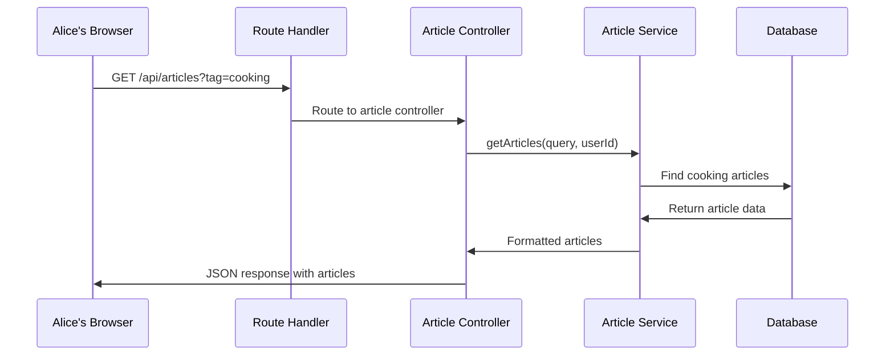

# Chapter 3: Route-Based API Architecture

Excellent work on building a secure system with [Chapter 2: Authentication & Authorization System](02_authentication___authorization_system_.md)! Now that we can safely identify users and protect their data, we need to organize our API endpoints in a way that makes sense and is easy to maintain as our application grows.

## The Problem: A Messy Restaurant Kitchen

Imagine you're running a popular restaurant that serves different types of food - Italian pasta, Japanese sushi, Mexican tacos, and American burgers. If all your chefs worked in one giant, chaotic kitchen without any organization, it would be a disaster! Orders would get mixed up, chefs would bump into each other, and customers would wait forever for their food.

Let's say a customer orders sushi. In a disorganized kitchen, the order might accidentally go to the pasta chef, who doesn't know how to make sushi, then get passed around until it finally reaches the sushi chef. By then, the customer has been waiting for an hour!

This is exactly what happens when you build an API without proper organization. All your code gets jumbled together, making it hard to find bugs, add new features, or even understand what each part does.

## Enter Route-Based Architecture: Your Restaurant's Organization System

In a well-organized restaurant, you have different stations for different types of food:

- **Italian Station**: Handles all pasta, pizza, and risotto orders
- **Sushi Station**: Takes care of all Japanese cuisine
- **Taco Station**: Manages Mexican food
- **Burger Station**: Deals with American classics

Each station has three key components:
1. **A waiter** (Controller) who takes orders and serves the final dish
2. **A kitchen** (Service) where the actual cooking happens  
3. **A menu** (Models) that describes what dishes are available

Our API works exactly the same way! We organize our code into different sections based on what they handle:

```
/api/articles    → Article Station (create, read, update articles)
/api/auth        → Authentication Station (login, register, user profile)
/api/profiles    → Profile Station (follow/unfollow users)
/api/tags        → Tag Station (get popular tags)
```

## Key Components of Route-Based Architecture

Let's break down the three main pieces that make each "station" work:

### 1. Controllers: The Waiters Taking Orders

Controllers are like waiters who greet customers, take their orders, and serve the final dish. They handle the incoming HTTP requests and send back responses:

```javascript
router.get('/articles', async (req, res, next) => {
  try {
    const result = await getArticles(req.query, req.auth?.user?.id);
    res.json(result);
  } catch (error) {
    next(error);
  }
});
```

This controller says: "When someone asks for articles, I'll get their request details, ask the kitchen (service) to prepare the articles, and serve them back to the customer."

### 2. Services: The Kitchen Doing the Work

Services are like the kitchen where the actual work happens. They contain the business logic and interact with the database:

```javascript
const getArticles = async (query, userId) => {
  // Kitchen logic: find articles in database
  const articles = await prisma.article.findMany({
    where: { /* filter conditions */ },
    include: { author: true, tags: true }
  });
  return articles;
};
```

The service takes the order from the controller, prepares it by talking to the database, and sends the prepared result back.

### 3. Models: The Menu Describing What's Available

Models define the structure of our data - like a menu that describes each dish:

```javascript
// Article "menu item" structure
{
  title: 'My Blog Post',
  description: 'A great article',
  body: 'Full article content...',
  author: { username: 'alice' },
  tags: ['cooking', 'recipes']
}
```

This tells everyone what an article should look like, just like a menu describes what ingredients go into each dish.

## How Route-Based Architecture Works Step-by-Step

Let's trace through what happens when Alice wants to read an article about cooking:



Here's what happens at each step:

1. **Alice makes a request**: Her browser asks for cooking articles using `/api/articles?tag=cooking`
2. **Router directs traffic**: The main router sees this is an article request and sends it to the article station
3. **Controller receives the order**: The article controller acts like a waiter, taking Alice's request
4. **Service does the work**: The article service goes to the database to find all cooking articles
5. **Database returns data**: Raw article data comes back from the database
6. **Service formats response**: The service cleans up the data and adds any needed information
7. **Controller serves the dish**: Alice gets a nice JSON response with her cooking articles

## Implementation Deep Dive: Building Our Restaurant Stations

Now let's explore how each station is built in our codebase:

### The Main Router: Restaurant Floor Plan

Our main router acts like the restaurant's floor plan, directing customers to the right station:

```javascript
const api = Router()
  .use(tagsController)
  .use(articlesController)
  .use(profileController)
  .use(authController);
```

This code connects all our different stations together. When a request comes in, it automatically goes to the right controller based on the URL path.

```javascript
export default Router().use('/api', api);
```

This adds the `/api` prefix to all our routes, so customers know they're ordering from our restaurant's API menu.

### Article Station: The Busiest Kitchen

The article station handles everything related to blog posts. Let's look at how it's organized:

**Taking Orders (Controller):**
```javascript
router.get('/articles', auth.optional, async (req, res, next) => {
  try {
    const result = await getArticles(req.query, req.auth?.user?.id);
    res.json(result);
  } catch (error) {
    next(error);
  }
});
```

This controller method says: "When someone wants to see articles, check if they're logged in (optional auth), get their filter preferences from the query, ask the service to find matching articles, and serve them back as JSON."

**Multiple Menu Options:**
```javascript
router.post('/articles', auth.required, async (req, res, next) => {
  // Create new article - requires login
});

router.put('/articles/:slug', auth.required, async (req, res, next) => {
  // Update existing article - requires login
});

router.delete('/articles/:slug', auth.required, async (req, res, next) => {
  // Delete article - requires login
});
```

Just like a restaurant has different pasta dishes, our article station offers different operations. Some require you to be logged in (like creating articles), while others are open to everyone (like reading articles).

### Authentication Station: The VIP Lounge

The auth station handles user accounts and login:

```javascript
router.post('/users', async (req, res, next) => {
  try {
    const user = await createUser({ ...req.body.user, demo: false });
    res.status(201).json({ user });
  } catch (error) {
    next(error);
  }
});
```

This creates new user accounts. Notice there's no `auth.required` here because you can't be logged in if you don't have an account yet!

```javascript
router.get('/user', auth.required, async (req, res, next) => {
  try {
    const user = await getCurrentUser(req.auth?.user?.id);
    res.json({ user });
  } catch (error) {
    next(error);
  }
});
```

This gets the current user's information, but only if they're already logged in. It's like asking "Who am I?" - you need to prove your identity first with the token from [Chapter 2: Authentication & Authorization System](02_authentication___authorization_system_.md).

### Profile Station: The Social Hub

The profile station manages user relationships:

```javascript
router.get('/profiles/:username', auth.optional, async (req, res, next) => {
  try {
    const profile = await getProfile(req.params.username, req.auth?.user?.id);
    res.json({ profile });
  } catch (error) {
    next(error);
  }
});
```

Anyone can look at user profiles, but if you're logged in, you'll see extra information like whether you're following that person.

```javascript
router.post('/profiles/:username/follow', auth.required, async (req, res, next) => {
  // Follow a user - must be logged in
});
```

Following someone requires authentication because we need to know who's doing the following!

### Service Layer: Where the Magic Happens

While controllers handle the "customer service" aspect, services contain the actual business logic. Here's how the article service finds articles:

```javascript
const getArticles = async (query, userId) => {
  // Build search filters based on what user requested
  const whereClause = {
    ...(query.tag && { tags: { some: { name: query.tag } } }),
    ...(query.author && { author: { username: query.author } })
  };

  // Get articles from database with all related data
  const articles = await prisma.article.findMany({
    where: whereClause,
    include: { author: true, tags: true, favoritedBy: true }
  });

  return articles;
};
```

This service method acts like a smart chef who can customize the dish based on the customer's preferences. If Alice wants cooking articles, it adds a tag filter. If she wants articles by a specific author, it adds an author filter.

## Real-World Example: Creating a New Article

Let's see the complete flow when Alice writes a new blog post:

1. **Alice sends her article**: `POST /api/articles` with article data
2. **Router directs to articles**: The main router sees `/api/articles` and sends it to the article controller
3. **Controller checks authentication**: `auth.required` middleware verifies Alice is logged in
4. **Controller calls service**: `createArticle(req.body.article, req.auth?.user?.id)`
5. **Service validates and saves**: The service checks the data and saves it using [Chapter 1: Data Persistence Layer (Prisma Integration)](01_data_persistence_layer__prisma_integration__.md)
6. **Response flows back**: The new article data flows back through service → controller → Alice's browser

Here's the controller handling this:

```javascript
router.post('/articles', auth.required, async (req, res, next) => {
  try {
    const article = await createArticle(req.body.article, req.auth?.user?.id);
    res.status(201).json({ article });
  } catch (error) {
    next(error);
  }
});
```

The controller is simple and focused - it just coordinates between the authentication system, the article service, and the response formatting.

## Error Handling: When Orders Go Wrong

Just like a good restaurant handles problems gracefully, our route architecture includes error handling:

```javascript
try {
  const result = await getArticles(req.query, req.auth?.user?.id);
  res.json(result);
} catch (error) {
  next(error);
}
```

If something goes wrong in the service layer (like a database error), the controller catches it and passes it to Express's error handling system. This ensures users get meaningful error messages instead of crashes.

## What We've Learned

In this chapter, we've built a clean, organized API architecture that works like a well-run restaurant. Key takeaways include:

- **Route Organization**: Different URL paths handle different types of operations, just like restaurant stations
- **Three-Layer Architecture**: Controllers (waiters) handle requests, Services (kitchen) do the work, Models (menu) define data structure  
- **Clear Separation**: Each component has a single responsibility, making code easier to understand and maintain
- **Scalability**: Adding new features means creating new routes and services without disrupting existing code
- **Error Handling**: Graceful error management ensures users get helpful feedback when things go wrong

With this organized architecture in place, your API is now structured like a professional restaurant where every team member knows their role and customers get fast, reliable service. The combination of secure authentication from [Chapter 2: Authentication & Authorization System](02_authentication___authorization_system_.md) and reliable data storage from [Chapter 1: Data Persistence Layer (Prisma Integration)](01_data_persistence_layer__prisma_integration__.md) creates a solid foundation for any web application.

You now have all the core building blocks needed to create scalable, maintainable web applications that can grow with your needs while keeping your code organized and your users' data secure!

