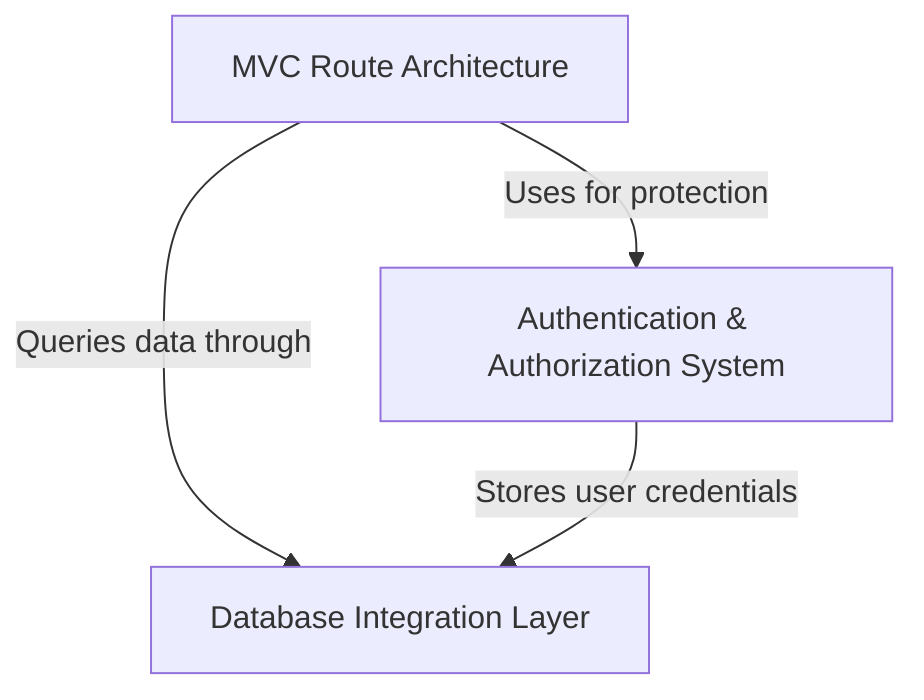

# Tutorial: mode-express-realworld-example-app

This is a **RealWorld blog application** built with Express.js that demonstrates a typical *social blogging platform*. 
Users can **register and authenticate** to create, edit, and delete articles, while also being able to *follow other users*, 
*favorite articles*, and *comment on posts*. The application uses a **three-layer architecture** where controllers handle 
HTTP requests, services contain business logic, and a database layer manages data persistence through *Prisma ORM*.

**Source Repository:** [https://github.com/joyrahaASC/mode-express-realworld-example-app](https://github.com/joyrahaASC/mode-express-realworld-example-app)

## Chapters

1. [MVC Route Architecture
](01_mvc_route_architecture_.md)
2. [Database Integration Layer
](02_database_integration_layer_.md)
3. [Authentication & Authorization System
](03_authentication___authorization_system_.md)
