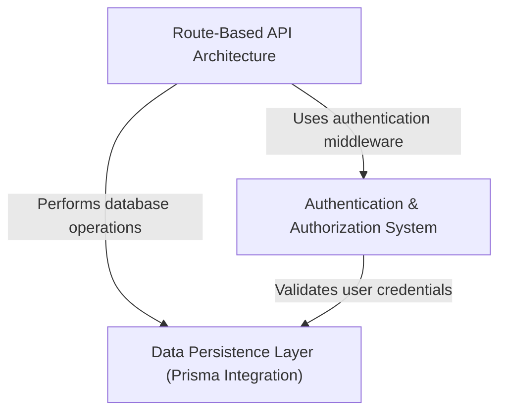

# Tutorial: 

This is a **Node.js REST API** that powers a blogging platform similar to Medium. Users can *register and authenticate* 
to create, read, update, and delete **articles**, leave **comments**, and follow other users. The application uses 
*Express.js* as the web framework, **Prisma** as the database ORM for type-safe data operations, and **JWT tokens** 
for secure user authentication. It's structured as a *modular API* with separate routes for articles, authentication, 
user profiles, and tags.

**Source Repository:** [https://github.com/joyrahaASC/mode-express-realworld-example-app/](https://github.com/joyrahaASC/mode-express-realworld-example-app/)

## Chapters

1. [Data Persistence Layer (Prisma Integration)
](01_data_persistence_layer__prisma_integration__.md)
2. [Authentication & Authorization System
](02_authentication___authorization_system_.md)
3. [Route-Based API Architecture
](03_route_based_api_architecture_.md)
